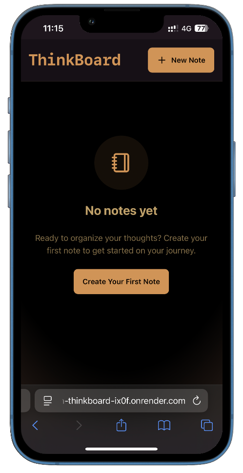
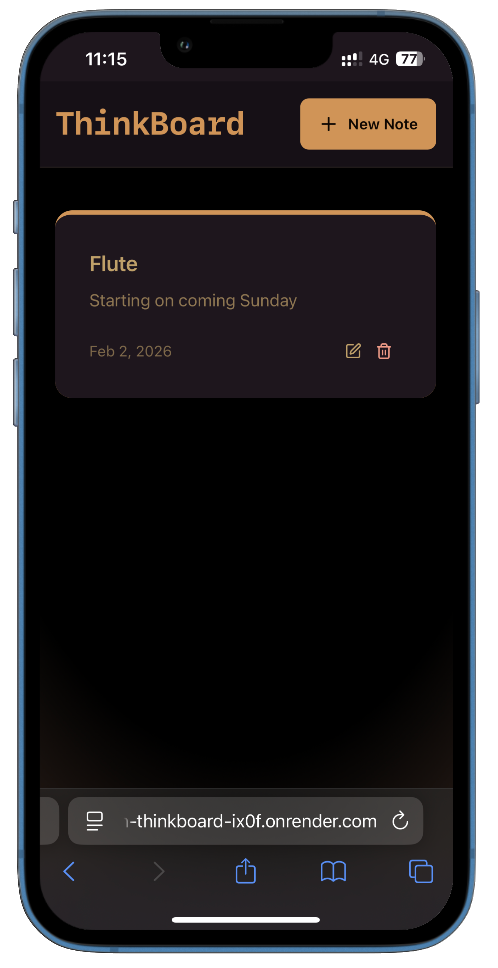
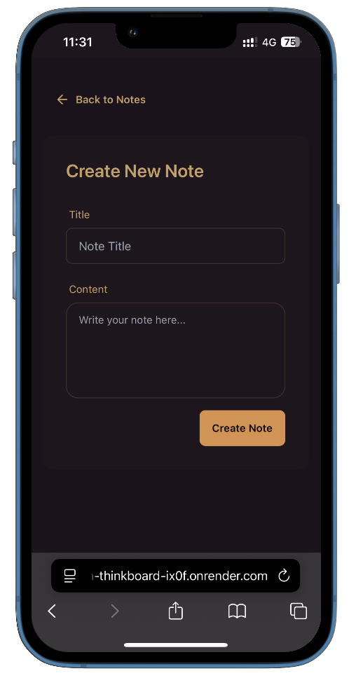
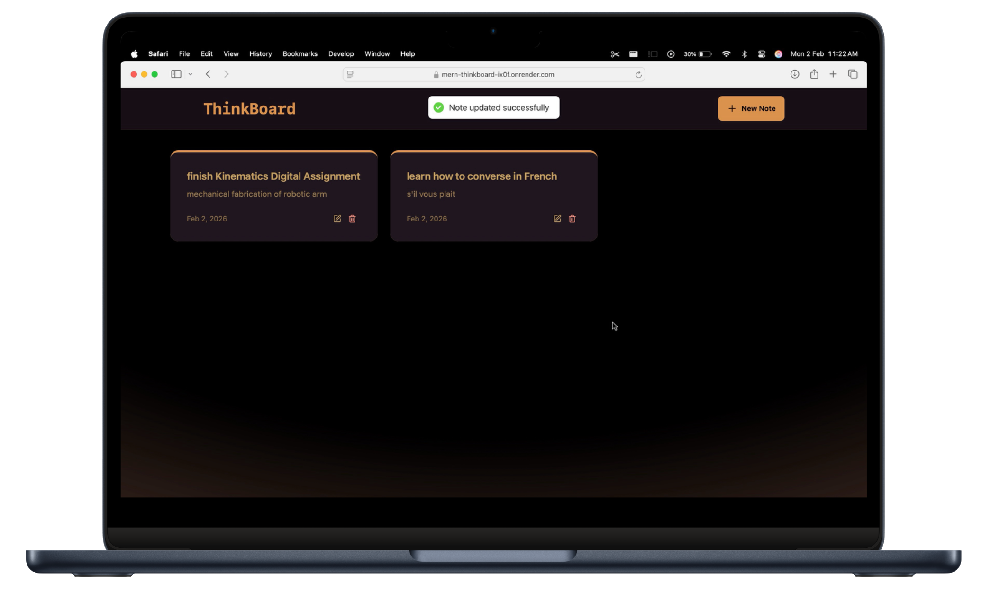
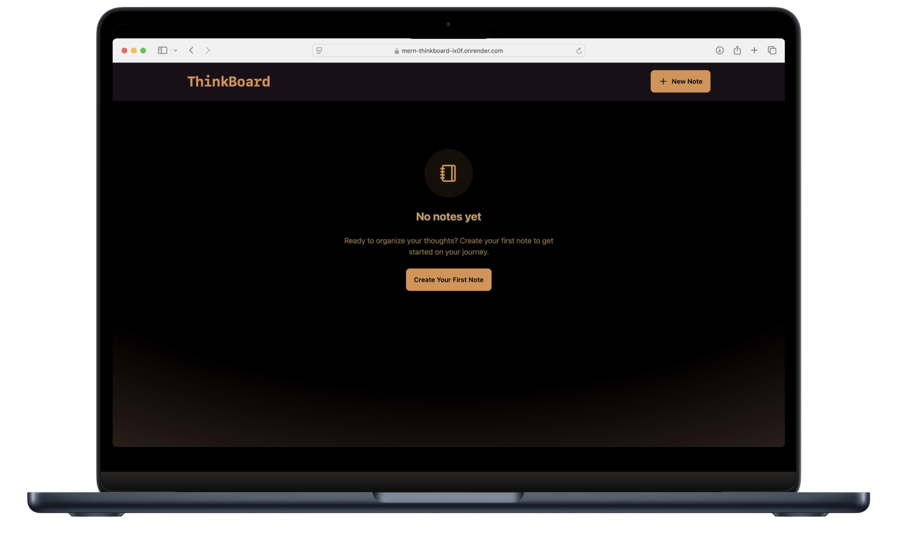
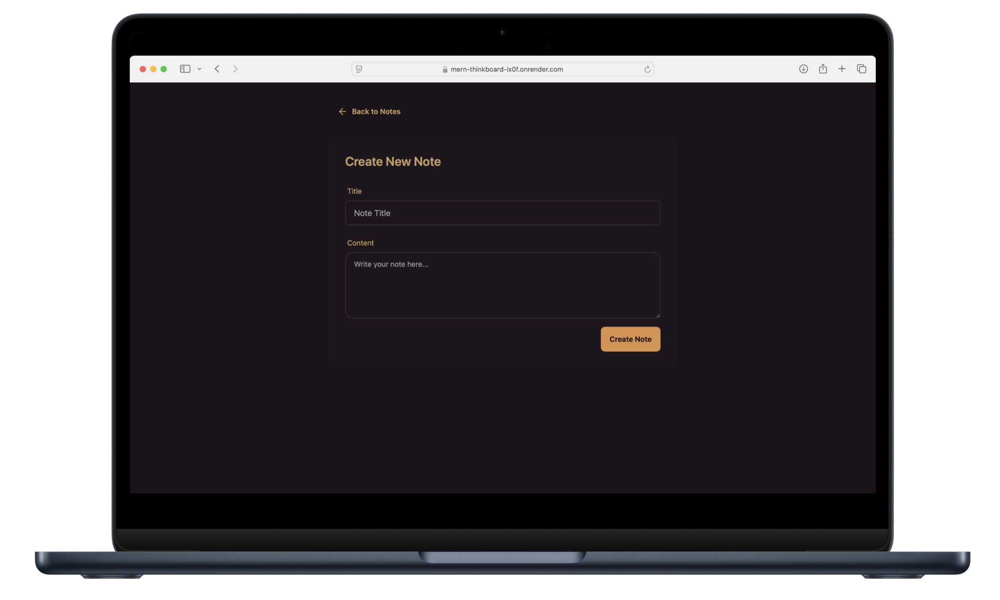

# Thinkboard

ThinkBoard is a simple app designed to help users take notes and stay organized.

## Website Preview

The website is hosted on render.

### Mobile View

<p align="center">
  
  
  
</p>

### Desktop View

<p align="center">
  
  
  
  
</p>

## Backend

.env file

```
MONGO_URI
PORT

UPSTASH_REDIS_REST_URL
UPSTASH_REDIS_REST_TOKEN

NODE_ENV=development
```

### Run the Backend

```
cd backend
npm install
npm run dev
```

## Frontend

### Run the Frontend

```
cd frontend
npm install
npm run dev
```

## Tech Stack

Implemented using MERN Stack

### Frontend

- **React**
- **Vite**
- **TailwindCSS**
- **Axios** <span style="color:grey;">HTTP client for making API requests</span>

### Backend

- **Node.js** <span style="color:grey;">JavaScript runtime</span>
- **Express.js** <span style="color:grey;">Node.js web application framework</span>
- **MongoDB** <span style="color:grey;">picked a NoSQL database because it works great for storing unstructured data like notes.</span>
- **Upstash Redis** <span style="color:grey;">Caching and rate limiting</span>

### extra tools

- **PostCSS** <span style="color:grey;">For CSS with JavaScript plugins</span>
- **Git** <span style="color:grey;">Version control</span>
